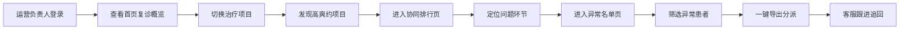

## 1. 产品概述

面向连锁口腔门店运营负责人的数据化复诊与爽约分析面板，聚焦门店复诊执行质量而非单个患者通知，助力多门店标准化管理与患者召回运营。

- **核心目标**：通过数据驱动发现复诊执行问题，提升患者复诊率，降低爽约率，优化医生与前台协同效率
- **目标用户**：连锁口腔机构运营负责人、门店店长
- **产品价值**：快速识别高风险治疗项目、评估医从协同质量、批量追回异常患者

## 2. 核心功能

### 2.1 用户角色

| 角色 | 登录方式 | 核心权限 |
|------|----------|----------|
| 运营负责人 | 账号登录 | 查看全部门店数据、导出异常名单、查看协同排行 |
| 门店店长 | 账号登录 | 查看本店数据、导出本店异常名单 |

### 2.2 功能模块

1. **首页复诊概览**：门店本周数据卡片、治疗项目切换、趋势图表
2. **协同排行页**：医生与前台协同排行榜、多维度指标对比
3. **异常名单页**：多维度筛选、一键导出、患者分派管理

### 2.3 页面详情

| 页面名称 | 模块名称 | 功能描述 |
|----------|----------|----------|
| 首页复诊概览 | 顶部导航栏 | Logo、页面切换、门店筛选、时间范围 |
| 首页复诊概览 | 数据概览卡片 | 本周预约数、到诊数、爽约率、改约率四大核心指标 |
| 首页复诊概览 | 门店数据列表 | 各门店四项指标横向对比，支持按指标排序 |
| 首页复诊概览 | 治疗项目筛选 | 正畸、种植、牙周、儿牙、综合等项目切换 |
| 首页复诊概览 | 趋势图表 | 近4周各项指标趋势折线图 |
| 协同排行页 | 医生排行列表 | 医生复诊建议预约完成率排名 |
| 协同排行页 | 前台排行列表 | 前台提醒完成率排名 |
| 协同排行页 | 综合指标对比 | 医嘱交代、前台跟进、患者依从性三环节漏斗分析 |
| 异常名单页 | 异常类型筛选 | 术后拆线未回访、正畸超6周未复诊、爽约两次以上 |
| 异常名单页 | 患者名单列表 | 患者信息、异常类型、建议处理方式 |
| 异常名单页 | 一键导出 | 导出CSV/Excel文件，支持分派标记 |

## 3. 核心流程

## 4. 用户界面设计

### 4.1 设计风格

- **主色调**：深青色/蓝绿色系（#0D9488），传递医疗专业感与信任感
- **辅助色**：暖橙（#F97316）用于警示/爽约指标，翠绿（#22C55E）用于正向指标
- **背景色**：浅灰底（#F8FAFC）配白色卡片，清爽洁净
- **按钮风格**：圆角矩形按钮，微阴影，悬停有微妙缩放效果
- **字体**：Inter 为主字体，数字使用等宽字体提升可读性
- **布局风格**：卡片式布局，清晰分区，数据密度适中
- **图标风格**：线性图标，2px 描边，与主色调一致

### 4.2 页面设计概述

| 页面名称 | 模块名称 | UI 元素 |
|----------|----------|---------|
| 首页复诊概览 | 数据概览卡片 | 渐变背景、大号数字、趋势箭头、同比环比标识 |
| 首页复诊概览 | 门店数据列表 | 表格+进度条、高亮异常值、排序箭头 |
| 首页复诊概览 | 项目筛选器 | 胶囊式标签组、选中态有背景色 |
| 协同排行页 | 排行列表 | 排名徽章、头像、姓名、指标进度条、综合得分 |
| 协同排行页 | 漏斗图 | 三环节转化漏斗，标注流失率 |
| 异常名单页 | 筛选区 | 多条件下拉筛选、搜索框、日期范围 |
| 异常名单页 | 患者列表 | 斑马纹表格、异常标签、操作按钮 |
| 异常名单页 | 导出按钮 | 主色按钮、下拉菜单支持多种格式 |

### 4.3 响应式

- 桌面端优先设计（1440px 基准）
- 平板端适配：卡片自动换行，表格可横向滚动
- 数据看板类应用，重点保证桌面端体验

### 4.4 数据可视化

- 使用 Recharts 图表库
- 折线图展示趋势，柱状图对比门店，漏斗图分析转化
- 图表有 hover 交互，显示详细数据
- 配色与整体设计系统一致
