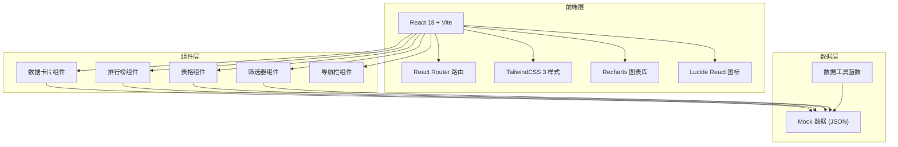
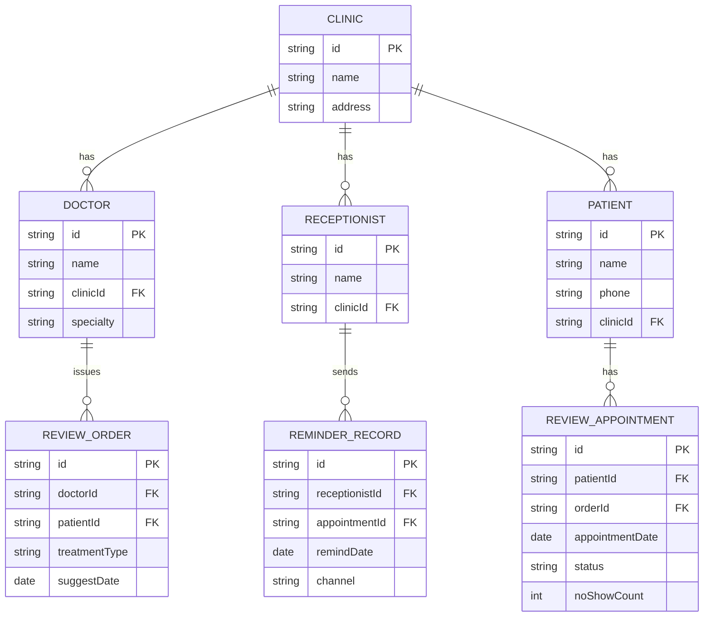

## 1. 架构设计



## 2. 技术描述

- **前端框架**：React@18 + Vite@5
- **路由管理**：React Router DOM@6
- **样式方案**：TailwindCSS@3
- **图表库**：Recharts@2
- **图标库**：Lucide React
- **初始化工具**：Vite 脚手架
- **后端**：无后端，使用 Mock 数据
- **数据**：本地 JSON Mock 数据

## 3. 路由定义

| 路由 | 页面组件 | 功能描述 |
|------|----------|----------|
| / | OverviewPage | 首页复诊概览 |
| /ranking | RankingPage | 医生与前台协同排行 |
| /abnormal | AbnormalPage | 异常名单导出 |

## 4. 数据模型

### 4.1 数据模型定义



### 4.2 Mock 数据结构

- **门店数据**：门店ID、名称、本周预约数、到诊数、爽约数、改约数
- **医生数据**：医生ID、姓名、所属门店、专科、建议数、预约完成率
- **前台数据**：前台ID、姓名、所属门店、提醒数、提醒完成率
- **患者异常数据**：患者ID、姓名、电话、所属门店、异常类型、详情
- **趋势数据**：近4周每周的预约、到诊、爽约、改约数据

## 5. 组件结构

```
src/
├── components/
│   ├── Layout/
│   │   ├── Sidebar.jsx      # 侧边导航栏
│   │   └── Header.jsx       # 顶部栏
│   ├── Overview/
│   │   ├── StatCard.jsx     # 数据统计卡片
│   │   ├── ClinicTable.jsx  # 门店数据表格
│   │   ├── TrendChart.jsx   # 趋势图表
│   │   └── ProjectFilter.jsx # 项目筛选器
│   ├── Ranking/
│   │   ├── DoctorRankList.jsx   # 医生排行榜
│   │   ├── ReceptionistRankList.jsx # 前台排行榜
│   │   └── FunnelChart.jsx      # 转化漏斗图
│   └── Abnormal/
│       ├── FilterPanel.jsx      # 筛选面板
│       ├── PatientTable.jsx     # 患者列表
│       └── ExportButton.jsx     # 导出按钮
├── pages/
│   ├── OverviewPage.jsx
│   ├── RankingPage.jsx
│   └── AbnormalPage.jsx
├── data/
│   └── mockData.js          # Mock 数据
├── utils/
│   └── helpers.js           # 工具函数
├── App.jsx
├── main.jsx
└── index.css
```

## 6. 核心功能实现要点

1. **数据统计卡片**：展示四大核心指标，带趋势箭头和环比变化
2. **项目筛选**：点击不同治疗项目，数据联动刷新
3. **排行榜**：支持按不同指标排序，显示排名变化
4. **异常筛选**：多条件组合筛选，实时更新列表
5. **导出功能**：前端生成 CSV 文件并触发下载
6. **响应式布局**：侧边栏导航 + 主内容区布局
